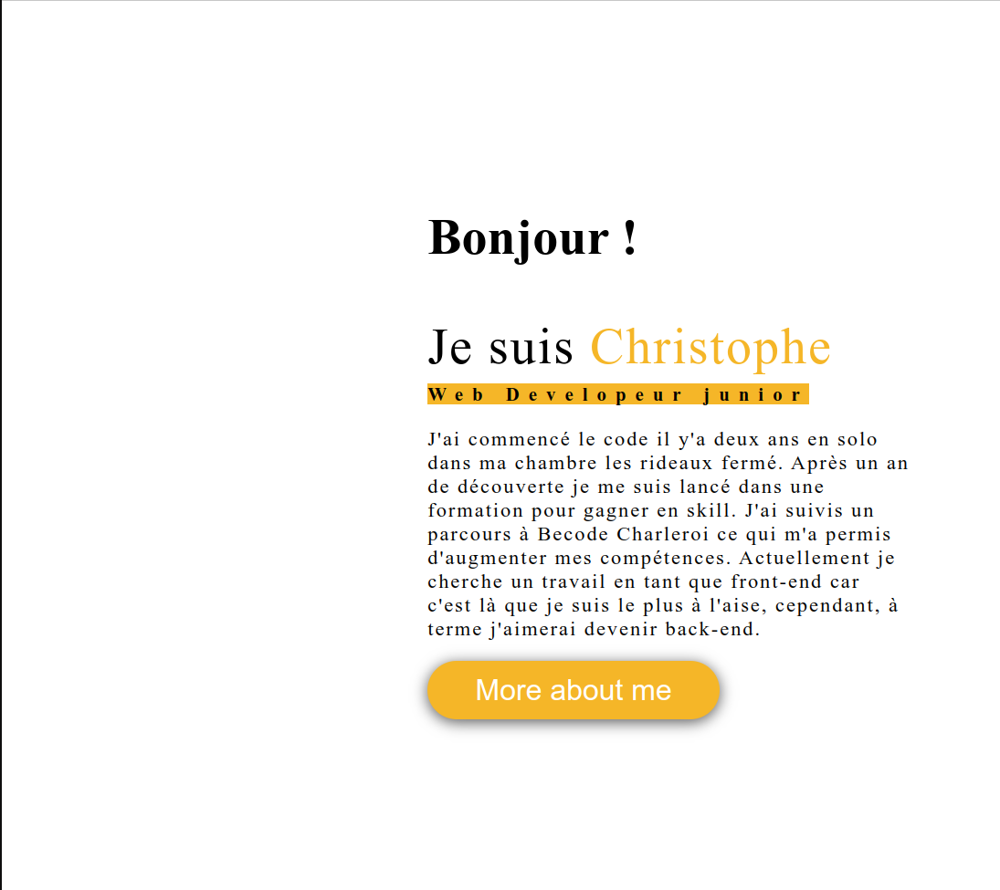
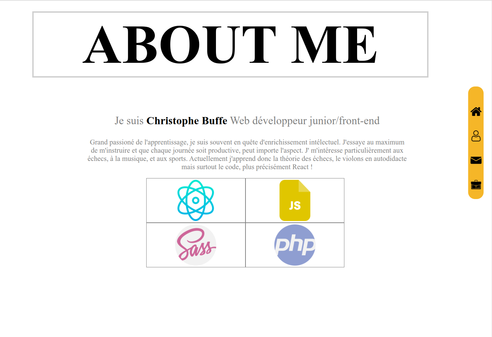
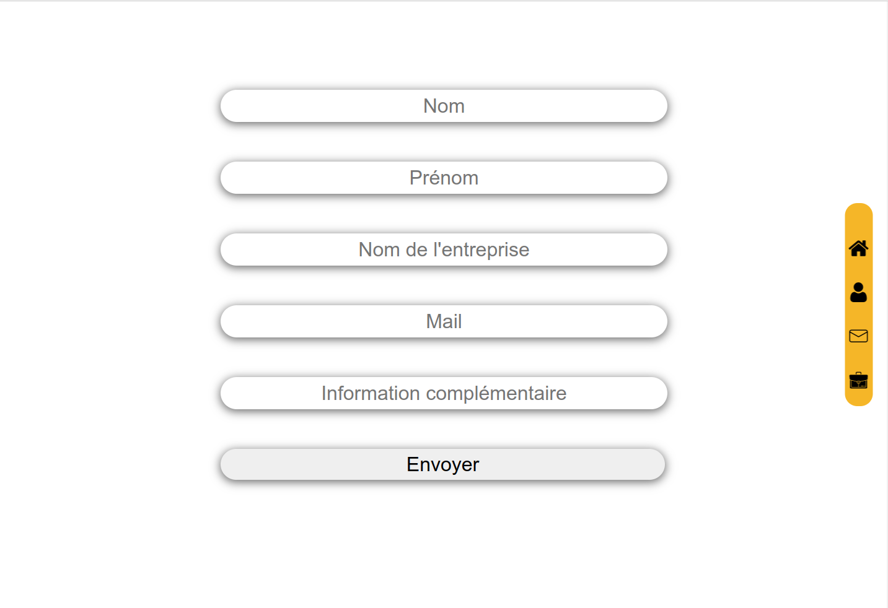
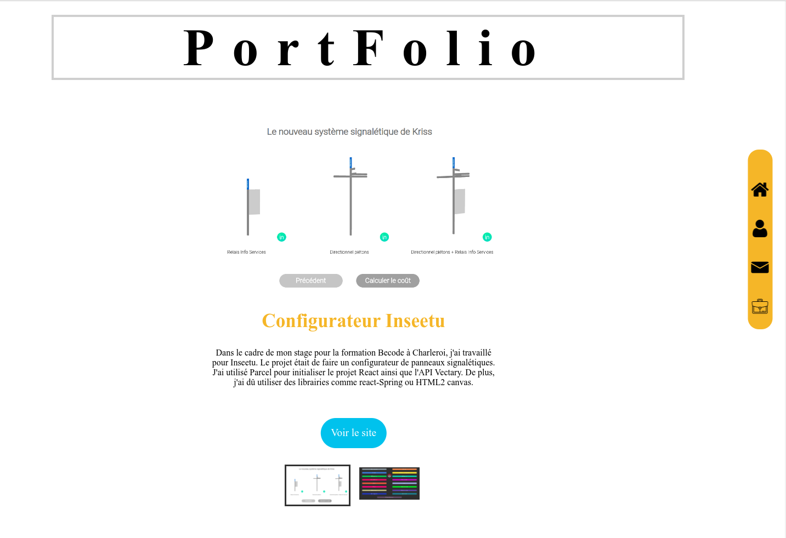

# PORTFOLIO

Comme son nom l'indique ceci est mon portfolio. Je me suis inspiré d'un modèle existant trouvé sur canvas.

# Technologie


## Description

Portfolio destiné à présenter mes projets. Le projet fu mis en pause lors du début de ma formation en tant que Dévelopeur front-end à Technocité Hornu. Depuis il doit être remis au frais.

## How to see it ?

Il suffit pour cela d'aller sur le site [https://christophe28.github.io/all-projects/]

## Project Structure

```
project
├── public
├── src
│   ├── components
│   │   ├── contact
│   │   ├── home
│   │   ├── navigation
│   │   ├── projects
│   │   └── view-wrapper
│   ├── config
│   ├── pages
│   ├── style
│   ├── App.js
│   └── index.js
├── package.json
└── README.md
```

## Screenshots






## Authors

- Christophe Buffe (www.linkedin.com/in/christophe-buffe)